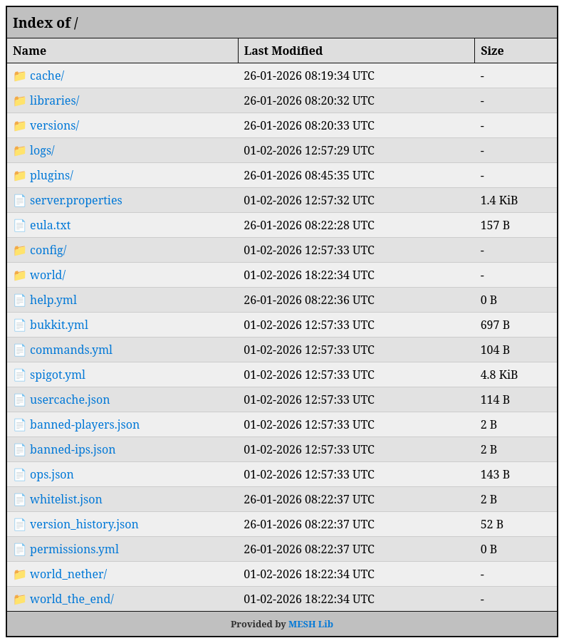

Handlers tell the mod how to handle requests.

They are json objects that consist of their identifier `type` and any fields specific to each handler.  
Below is a list of all supported handlers:

|                                         |                                                               |
|-----------------------------------------|---------------------------------------------------------------|
| [`static-content`](#static-content)     | Responds with static text                                     |
| [`static-file`](#static-file)           | Responds with a specific file                                 |
| [`static-directory`](#static-directory) | Responds with files from a directory and optionally a listing |

### Static content
```json
{
  "content": "Hello, World!",
  "type": "static-content"
}
```
This handler always responds with the provided `content` text.

### Static file
```json
{
  "fileToServe": "resourcepack.zip",
  "type": "static-file"
}
```
This handler always responds with the content of the file located at the provided `fileToServe` path.  
Could be used for example to host a server's resource pack... But for that I've also got [Git Pack Manager](https://modrinth.com/mod/git-pack-manager) so y'know maybe use that.

### Static directory
```json {"    Optional, defaults to false":3-4}
{
  "baseDir": ".",
  
  "allowDirectoryList": false,
  "type": "static-directory"
}
```
This handler responds with requested files in the provided directory.  
`index.html` files will automatically be served at the root level if they exist.

Optionally allows serving a directory listing that looks like this:

